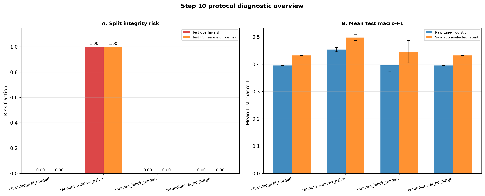
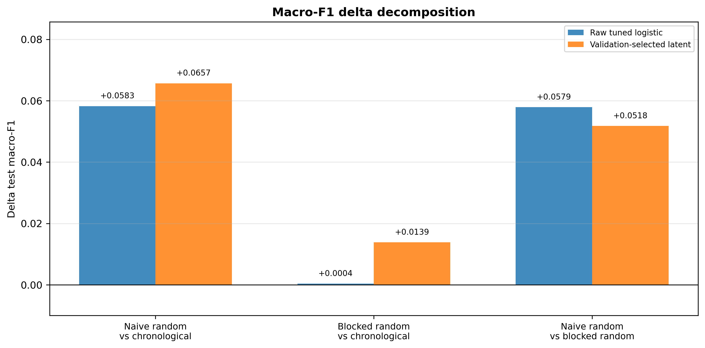
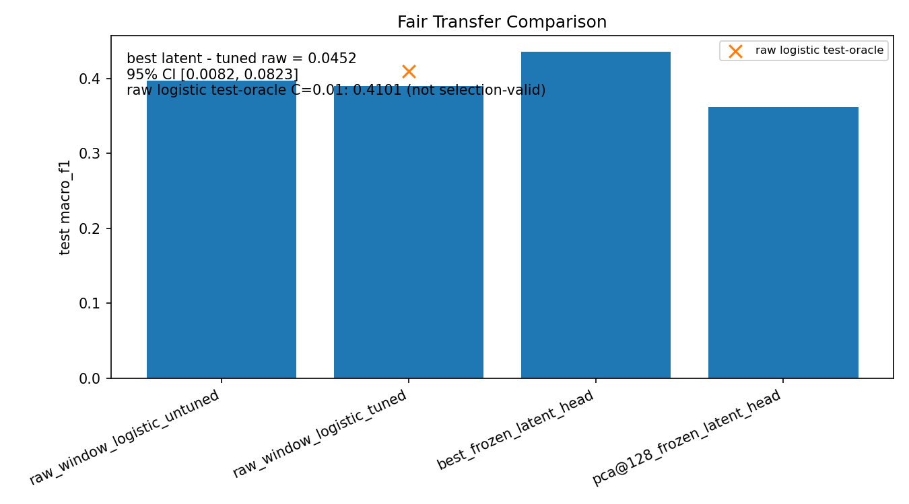
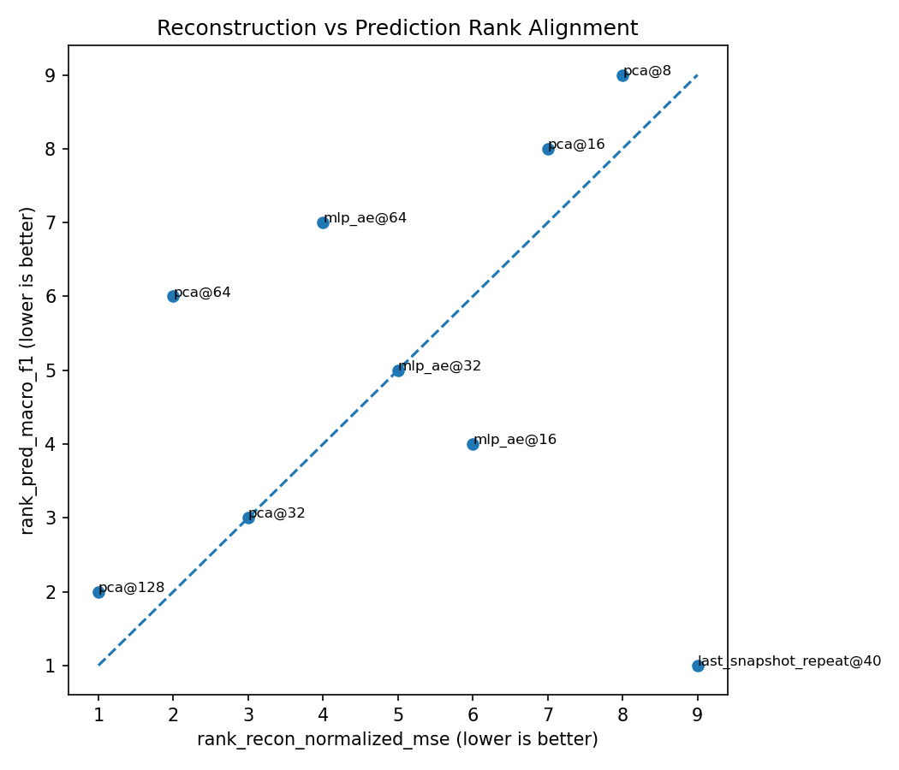
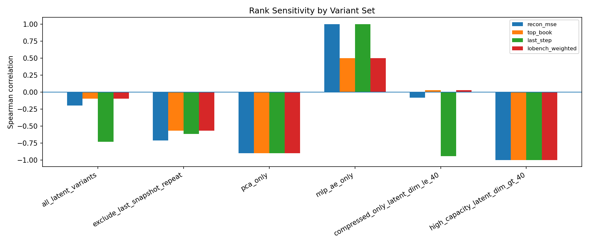

# LOB Representation Diagnostic

## One-line Summary

A leakage-aware diagnostic study of whether LOB reconstruction quality transfers to downstream mid-price trend prediction under chronological evaluation.

## Why This Matters

Financial LOB windows are highly overlapping. If train/test splits are randomized at the window level, downstream prediction metrics may be inflated by near-neighbor exposure. This project uses LOBench-style processed A-share data to test reconstruction-prediction alignment under stricter split protocols.

## Main Takeaways

1. **Split protocol matters.** Naive random window splitting creates full train/test near-neighbor exposure and materially higher macro-F1, while blocked random with embargo stays close to chronological performance.

2. **Reconstruction quality is not a standalone downstream proxy.** The best full-window reconstruction variant is `pca@128`, but the best validation-selected frozen-head predictor is `last_snapshot_repeat@40`.

3. **The claim is intentionally narrow.** The evidence is limited to `sz000001`, `trend5`, and one stride-4 subset. This is a diagnostic PoW, not a full benchmark, SOTA claim, or trading study.

This is not a full LOBench reproduction, not a state-of-the-art claim, not a trading PnL study, and not a general market prediction claim.

Scope: one symbol, `sz000001`; one label, `trend5`; one stride-4 subset. No cross-symbol, cross-horizon, or trading generality is claimed.

## Protocol at a Glance

| Field | Setting |
| --- | --- |
| Dataset source | External LOBench A-share processed data |
| Symbol | `sz000001` |
| Label | `trend5` |
| Window | `100` |
| Feature dimension | `40` |
| Sample stride | `4` |
| Conservative baseline split | Boundary-purged chronological `70/15/15` |
| Step 10 split diagnostics | `random_window_naive`, `random_block_purged`, `chronological_no_purge` |
| Samples | `7952` |
| Train / val / test | `5600 / 1200 / 1152` |
| Data policy | External data, generated tensors, checkpoints, and latent arrays are not committed |

## Split Protocol Demonstration

Step 10 is the clearest visual diagnostic. It asks whether random-split gains come from legitimate temporal distribution mixing or from overlapping-window near-neighbor exposure.

*Caption: Naive random window-level splitting has full train/test overlap and k5 near-neighbor exposure in this subset, while blocked random with embargo removes that exposure. The performance panel shows that naive random also raises test macro-F1.*

*Caption: Most of the naive-random macro-F1 gain disappears when switching from naive window-level randomization to blocked random with embargo, especially for the tuned raw-window logistic control.*

Interpretation:

- Naive random split is an optimistic diagnostic protocol, not a recommended evaluation protocol.
- `random_window_naive` improves tuned raw-window logistic test macro-F1 by `0.0583` over chronological.
- `random_block_purged` improves tuned raw-window logistic test macro-F1 by only `0.0004` over chronological.
- The naive-vs-blocked gap is therefore the main evidence that the naive-random gain is mostly near-neighbor exposure in this subset.

Note: Step 10 is a lightweight within-step protocol rerun. Its absolute metrics should be interpreted through within-step contrasts rather than as replacements for the Step 8/9 headline metrics. `chronological_no_purge` is a no-extra-purge diagnostic on the existing Step 3 kept sample universe; it does not restore Step 3 boundary-dropped samples.

## Evidence Snapshot

| Evidence | Result | Caveat |
| --- | --- | --- |
| Prediction baseline | Step 5 logistic regression, test macro-F1 `0.3972` | Fixed-C raw-window baseline |
| Tuned raw-window logistic control | test macro-F1 `0.3904`, selected `C=0.1` | Selected by validation macro-F1 |
| Validation-selected frozen latent head | `last_snapshot_repeat@40`, test macro-F1 `0.4355` | Selected by validation macro-F1, not test |
| Paired bootstrap, validation-selected latent vs tuned raw | macro-F1 delta `0.0452`, 95% CI `[0.0082, 0.0799]`, `fraction_delta_gt_0=0.9930` | Descriptive, not fully pre-registered |
| Best reconstruction variant | `pca@128`, test normalized MSE `0.1838` | Not the best prediction variant across all variants |
| Rank sensitivity | excluding `last_snapshot_repeat@40` makes `pca@128` both reconstruction-best and prediction-best | Broad rank-mismatch claim is partial |
| Split integrity audit | naive random overlap risk `1.0000`; blocked random overlap risk `0.0000` | Random split result is diagnostic |

## Transfer and Rank Evidence

*Caption: Step 8 fair-transfer visualization. Step 9 shows the same latent variant is selected by validation macro-F1, so the plotted best-frozen-latent comparison matches the validation-selected comparison in this run.*

*Caption: Reconstruction rank and frozen-head prediction rank do not perfectly align across all variants, with the strongest mismatch driven by `last_snapshot_repeat@40`.*

*Caption: Rank mismatch weakens after excluding `last_snapshot_repeat@40`, so the mismatch claim is partial rather than general.*

## What to Inspect

| File | Purpose |
| --- | --- |
| [technical_memo.md](technical_memo.md) | Final technical memo and conservative interpretation |
| [results/step10_split_protocol_decomposition/split_integrity_audit.csv](results/step10_split_protocol_decomposition/split_integrity_audit.csv) | Overlap and near-neighbor risk by split protocol |
| [results/step10_split_protocol_decomposition/protocol_contrasts.csv](results/step10_split_protocol_decomposition/protocol_contrasts.csv) | Main Step 10 protocol contrast table |
| [results/step9_validation_selection_audit/step9_manifest.json](results/step9_validation_selection_audit/step9_manifest.json) | Validation-selected representation audit |
| [results/step9_validation_selection_audit/fair_transfer_comparison.csv](results/step9_validation_selection_audit/fair_transfer_comparison.csv) | Validation-selected transfer comparison |
| [results/step8_fairness_robustness/final_claim_table.csv](results/step8_fairness_robustness/final_claim_table.csv) | Step 8 claim table before the Step 9 representation-selection audit |
| [results/step7_alignment/join_contract.json](results/step7_alignment/join_contract.json) | Join validation |
| [docs/artifact_index.md](docs/artifact_index.md) | Full artifact map |
| [docs/reproduction_guide.md](docs/reproduction_guide.md) | Commands to reproduce Step 3 to Step 10 |
| [docs/data_note.md](docs/data_note.md) | Data contract, subset facts, and split policy |
| [docs/environment.md](docs/environment.md) | Local runtime and external data assumptions |

## Reproduction

Reproduction commands are collected in [docs/reproduction_guide.md](docs/reproduction_guide.md). The pipeline requires the external processed A-share dataset locally. Raw data, generated tensors, checkpoints, and latent arrays are not committed.

## Scope and Limitations

| Boundary | Current status |
| --- | --- |
| Symbol coverage | One symbol, `sz000001` |
| Horizon coverage | One label horizon, `trend5` |
| Sampling protocol | One stride-4 subset |
| Split protocol | Step 10 compares chronological, naive random, blocked random, and no-purge diagnostics on the same subset |
| Multi-symbol robustness | Not evaluated |
| Multi-horizon robustness | Not evaluated |
| Regime / failure-case diagnostics | Deferred to future work as Step 11; not part of the current evidence chain |
| Trading PnL | Not evaluated |
| Best frozen latent head | Validation-selected in Step 9; candidate set fixed by earlier steps |
| Bootstrap comparison | Descriptive, not fully pre-registered confirmatory evidence |

## Future Work

The next natural extension is a regime and failure-case diagnostic layer, deferred here as Step 11 rather than included in the current evidence chain. It should slice errors by interpretable market-state variables such as spread, volatility, liquidity, imbalance validity, and top-of-book movement, then test whether the reconstruction-prediction mismatch is concentrated in specific regimes. That extension should be treated as explanatory analysis, not as new primary evidence, until repeated across additional symbols and horizons.

## Repository Layout

- `src/data/`: data loading, field mapping, labels, subset construction.
- `src/models/`: prediction and reconstruction baseline models.
- `src/analysis/`: metrics and diagnostic utilities.
- `scripts/`: runnable stage entry points.
- `docs/`: protocol, artifact index, and reproduction notes.
- `results/`: committed result and audit artifacts.
- `figures/`: plots and visual diagnostics.
