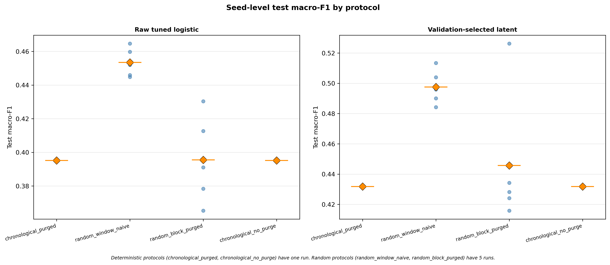
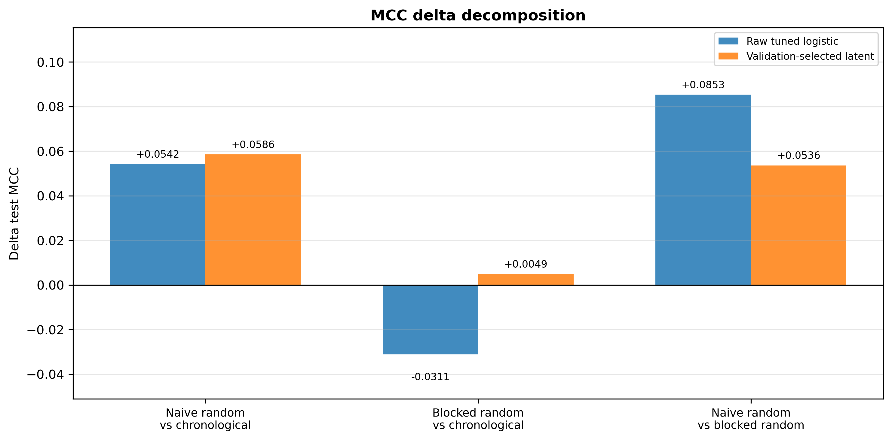
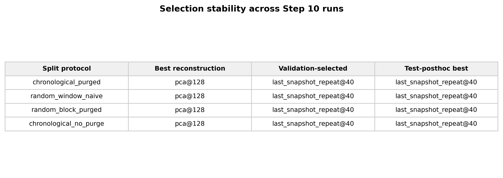

# Technical Memo

## 1. Problem Definition

This proof of work tests a narrow diagnostic question:

> Does better limit order book reconstruction imply better downstream mid-price trend prediction under a leakage-aware chronological split?

The project separates reconstruction quality from predictive usefulness. A reconstruction model can reduce average book-level error by modeling stable or distant levels, while the prediction target may depend more on top-of-book state, local liquidity, spread behavior, or short-horizon directional changes. The central test is therefore not whether reconstruction loss can be made small, but whether lower reconstruction error aligns with better `trend5` prediction under a controlled protocol.

This memo is not a claim of full LOBench reproduction. It does not claim state-of-the-art prediction or reconstruction performance. It does not evaluate trading profitability, execution quality, or portfolio performance. It also does not claim general market predictability across symbols, horizons, dates, or regimes.

The current evidence is limited to one symbol, one horizon, and one stride-4 subset. Steps 3 through 9 use a boundary-purged chronological split as the conservative baseline. Step 10 adds a lightweight split-protocol decomposition on the same sample universe.

## 2. Experimental Setup

The baseline data setup is:

| Field | Value |
| --- | --- |
| Dataset source | LOBench A-share processed data, kept outside the repository |
| Symbol | `sz000001` |
| Label | `trend5` |
| Window length | `100` |
| Feature dimension | `40` |
| Input tensor | `(N, 100, 40)` |
| Sample stride | `4` |
| Conservative baseline split | Boundary-purged chronological `70/15/15` |
| Total samples | `7952` |
| Train samples | `5600` |
| Validation samples | `1200` |
| Test samples | `1152` |

The baseline split is chronological and boundary-purged. Historical rows overlapping train/validation and validation/test boundaries are removed, so adjacent windows do not leak across split boundaries. Step 10 then treats split protocol as a diagnostic variable on the same kept sample universe.

External data remains local and is not committed. Generated data arrays and latent arrays are also not part of the repository evidence. The committed artifacts are result tables, audit artifacts, summaries, run configs, and figures.

## 3. Metrics and Evidence

The evidence chain uses different metrics for different purposes.

Prediction metrics:

- `macro_f1`, the primary metric for imbalanced directional diagnosis.
- Balanced accuracy and MCC, to reduce dependence on the majority neutral class.
- Log loss, retained as a cross-entropy-style probability-quality metric.
- Directional diagnostics, including non-neutral precision/recall, directional accuracy on true non-neutral samples, up/down macro-F1, and opposite-direction rate.

Reconstruction metrics:

- Normalized MSE and normalized MAE in the Step 6 standardized reconstruction space.
- Original-space MAE/RMSE after inverse-transforming the Step 6 scaler back to the Step 3 input feature space, not raw exchange order-flow scale.
- Price, volume, level-wise, temporal, top-of-book, midprice, spread, and volume-sum/difference diagnostics.
- LOBench-compatible reconstruction metrics, including weighted MSE and all-loss style summaries.

Alignment diagnostics:

- Sample-level joins between Step 5 predictions and Step 6 reconstruction diagnostics.
- Spearman and point-biserial associations between reconstruction diagnostics and prediction outcomes.
- Error-quantile response curves.
- Model-level rank alignment between reconstruction quality and frozen-latent prediction quality.

Robustness controls:

- A tuned raw-window logistic control using the same C grid and validation-selection policy as the frozen latent heads.
- A raw logistic test-oracle reference, clearly marked as post hoc and not a valid selection baseline.
- Paired bootstrap on the same test samples.
- Rank sensitivity after excluding `last_snapshot_repeat@40`.
- Last-snapshot sensitivity, noting that `last_snapshot_repeat@40` has zero last-step reconstruction error by construction.
- Split-protocol decomposition, including naive random window split, blocked random with embargo, and a no-purge chronological diagnostic.

## 4. Results

### Prediction Baselines

Step 5 trains prediction-only baselines on the stride-4 subset. These baselines set the raw-window prediction reference and do not use reconstruction features.

Test split:

| Model | Accuracy | Balanced Accuracy | Macro-F1 | MCC | Log Loss |
| --- | ---: | ---: | ---: | ---: | ---: |
| majority | 0.6441 | 0.3333 | 0.2612 | 0.0000 | 0.8980 |
| logistic_regression | 0.4826 | 0.4098 | 0.3972 | 0.1007 | 4.1624 |
| mlp | 0.4036 | 0.4513 | 0.3816 | 0.1624 | 1.2767 |

The fixed raw-window logistic regression baseline has the best Step 5 test macro-F1 (`0.3972`). The majority baseline has the best log loss (`0.8980`), which shows that directional separation and probability calibration are different properties in this subset. Macro-F1 remains the primary diagnostic metric for directional classification, while log loss is reported for probability-quality context.

### Reconstruction Baselines

Step 6 trains reconstruction-only baselines on the same split. It does not train prediction heads.

Test split:

| Model | Latent Dim | Test Normalized MSE | Test Normalized MAE | Test Original MAE | Relative MSE vs Last Snapshot |
| --- | ---: | ---: | ---: | ---: | ---: |
| pca | 128 | 0.1838 | 0.1871 | 0.1267 | 0.1003 |
| pca | 32 | 0.4245 | 0.3093 | 0.2133 | 0.2317 |
| mlp_ae | 64 | 0.4251 | 0.3736 | 0.2424 | 0.2320 |
| last_snapshot_repeat | 40 | 1.8321 | 0.4410 | 0.2872 | 1.0000 |
| train_mean_window | - | 2.2013 | 0.9195 | 0.5141 | 1.2015 |

`pca@128` is the best reconstruction variant among the tested baselines by test normalized MSE (`0.1838`). It is also best by the LOBench-compatible weighted MSE on test (`0.2917`). The reconstruction results support the expected control behavior: PCA with higher latent dimension reconstructs the standardized windows much better than the last-snapshot and train-mean baselines.

The imbalance diagnostics are validity-gated. Because top1/top5 imbalance validity remains below threshold for the best model, downstream alignment emphasizes volume-sum and volume-difference diagnostics rather than imbalance MAE as a primary field.

### Sample-Level Alignment Contract

Step 7 joins Step 5 per-sample predictions with Step 6 per-sample reconstruction diagnostics on `sample_id`, `split`, and `y_true`, after renaming model columns to avoid semantic collision.

Join contract:

| Field | Value |
| --- | ---: |
| Step 5 prediction rows | 7056 |
| Step 6 reconstruction rows | 79520 |
| Expected joined rows | 70560 |
| Actual joined rows | 70560 |
| Duplicate joined keys | 0 |
| Status | passed |

This supports the validity of the sample-level alignment panel for validation/test diagnostics.

### Frozen-Latent Transfer

Step 7 trains logistic heads on frozen reconstruction latents. The reconstruction encoders are not retrained. The head uses a train-only `StandardScaler`, `class_weight="balanced"`, C grid `{0.01, 0.1, 1.0, 10.0}`, and validation macro-F1 selection with MCC and log-loss tie-breaks. The leaderboard below is the original Step 7/8 transfer view, before the Step 9 validation-selected representation audit.

Compact transfer leaderboard on the test split:

| Source | Variant | Selection Basis | Test Macro-F1 | Balanced Accuracy | MCC | Log Loss |
| --- | --- | --- | ---: | ---: | ---: | ---: |
| frozen latent head | last_snapshot_repeat@40 | post hoc best Step 7 test macro-F1 | 0.4355 | 0.5509 | 0.2579 | 1.0743 |
| raw window baseline | logistic_regression | fixed Step 5 logistic | 0.3972 | 0.4098 | 0.1007 | 4.1624 |
| matched raw-window head | raw_window_logistic_tuned | validation macro-F1, MCC/log-loss tie-break | 0.3904 | 0.4079 | 0.0978 | 2.0500 |
| raw window oracle reference | raw_window_logistic_test_oracle | post hoc best raw-grid test macro-F1 | 0.4101 | 0.4532 | 0.1473 | 1.3221 |
| raw window baseline | mlp | fixed Step 5 MLP | 0.3816 | 0.4513 | 0.1624 | 1.2767 |
| frozen latent head | pca@128 | reconstruction-best test normalized MSE | 0.3624 | 0.4143 | 0.1281 | 1.2174 |
| raw window baseline | majority | fixed majority baseline | 0.2612 | 0.3333 | 0.0000 | 0.8980 |

The best frozen latent head, `last_snapshot_repeat@40`, has higher test macro-F1 (`0.4355`) than the fixed raw-window logistic baseline (`0.3972`) and the validation-selected tuned raw-window logistic control (`0.3904`). The raw logistic C grid contains a test-oracle point at `C=0.01` with test macro-F1 `0.4101`; this is reported for transparency but is not a valid model-selection baseline because it is selected after observing test performance.

At the Step 7/8 stage, this transfer result was descriptive rather than fully confirmatory because `best_frozen_latent_head` was identified from Step 7 test macro-F1. Step 9 below audits that specific representation-selection caveat.

### Rank Alignment

Model-level rank alignment compares reconstruction quality against frozen-latent prediction quality on the test split.

| Variant | Test Recon MSE | Test Macro-F1 | Recon Rank | Prediction Rank | Interpretation |
| --- | ---: | ---: | ---: | ---: | --- |
| pca@128 | 0.1838 | 0.3624 | 1 | 2 | aligned |
| pca@64 | 0.2803 | 0.3505 | 2 | 6 | better reconstruction than prediction |
| pca@32 | 0.4245 | 0.3619 | 3 | 3 | aligned |
| mlp_ae@64 | 0.4251 | 0.3417 | 4 | 7 | better reconstruction than prediction |
| last_snapshot_repeat@40 | 1.8321 | 0.4355 | 9 | 1 | better prediction than reconstruction |

Across the nine frozen-latent variants, the best reconstruction variant is `pca@128`, while the best frozen-head prediction variant is `last_snapshot_repeat@40`. Spearman(`test_recon_normalized_mse`, `test_pred_macro_f1`) is `-0.2000`, while Spearman(`test_recon_last_step_mse`, `test_pred_macro_f1`) is `-0.7333`. These are descriptive correlations only, because the variant count is small.

### Fairness and Robustness

Step 8 adds controls around the Step 7 transfer and rank conclusions without changing data construction, split logic, reconstruction encoders, or latent artifacts.

Fair transfer comparison on the test split:

| Variant | Source | Selection Basis | Test Macro-F1 | MCC | Delta vs Tuned Raw |
| --- | --- | --- | ---: | ---: | ---: |
| raw_window_logistic_untuned | raw window baseline | fixed Step 5 logistic | 0.3972 | 0.1007 | 0.0068 |
| raw_window_logistic_tuned | raw window tuned control | validation macro-F1, MCC/log-loss tie-break | 0.3904 | 0.0978 | 0.0000 |
| raw_window_logistic_test_oracle | raw window oracle reference | post hoc best raw-grid test macro-F1 | 0.4101 | 0.1473 | 0.0198 |
| best_frozen_latent_head | frozen latent head | post hoc best Step 7 test macro-F1 | 0.4355 | 0.2579 | 0.0452 |
| pca@128_frozen_latent_head | frozen latent head | reconstruction-best test normalized MSE | 0.3624 | 0.1281 | -0.0280 |

The validation-selected tuned raw-window logistic control selects `C=0.1` and reaches test macro-F1 `0.3904`. Paired bootstrap on the same test samples gives a macro-F1 delta of `0.0452` for best frozen latent versus tuned raw logistic, with 95% CI `[0.0082, 0.0823]` and `fraction_delta_gt_0=0.9930`.

At the Step 8 stage, this supported the narrow descriptive claim that the post hoc best frozen latent head was stronger than the tuned raw-window logistic control on test macro-F1 in this subset. Step 9 below updates the selection interpretation by applying validation-only representation selection. The comparison still does not become fully pre-registered or general.

Rank sensitivity:

| Variant Set | N | Recon MSE vs Macro-F1 Spearman | Best Reconstruction | Best Prediction | Interpretation |
| --- | ---: | ---: | --- | --- | --- |
| all_latent_variants | 9 | -0.2000 | pca@128 | last_snapshot_repeat@40 | rank_mismatch_persists |
| exclude_last_snapshot_repeat | 8 | -0.7143 | pca@128 | pca@128 | rank_mismatch_weakens |
| pca_only | 5 | -0.9000 | pca@128 | pca@128 | rank_mismatch_weakens |
| mlp_ae_only | 3 | 1.0000 | mlp_ae@64 | mlp_ae@16 | rank_mismatch_persists |

The all-variant rank mismatch is influenced by `last_snapshot_repeat@40`. After excluding that special baseline, `pca@128` becomes both reconstruction-best and prediction-best. The rank-mismatch claim is therefore only partially supported.

### Validation-Selected Representation Audit

Step 9 audits the main Step 8 transfer caveat: the best frozen latent head should not be selected by looking at test macro-F1. It reuses the fixed Step 7 latent-head candidates and selects the representation variant using validation split metrics only.

Selection policy:

1. Highest validation macro-F1.
2. Highest validation MCC.
3. Lowest validation log loss.
4. Smaller latent dimension.
5. Lexical representation-variant order.

Under this policy, the validation-selected latent variant is `last_snapshot_repeat@40`. The test-posthoc best latent variant is also `last_snapshot_repeat@40`. Its held-out test macro-F1 is `0.4355`, compared with `0.3904` for the tuned raw-window logistic control, a delta of `0.0452`. The paired bootstrap delta for validation-selected latent versus tuned raw logistic is `0.0452`, with 95% CI `[0.0082, 0.0799]` and `fraction_delta_gt_0=0.9930`.

This reduces the post hoc representation-selection caveat for this run because validation macro-F1 and test macro-F1 select the same latent variant. It does not prove transferability in general. The candidate set is fixed by earlier steps, the evidence remains one symbol and one horizon, and the bootstrap remains a descriptive paired test-sample check.

### Split Protocol Decomposition

Step 10 treats split protocol as an experimental variable rather than a fixed background choice. The goal is to distinguish temporal or regime mixing from near-neighbor exposure caused by overlapping LOB windows.

Protocols compared:

| Protocol | Runs | Role |
| --- | ---: | --- |
| `chronological_purged` | 1 | Conservative baseline used by Steps 3-9 |
| `random_window_naive` | 5 seeds | Optimistic window-level random split |
| `random_block_purged` | 5 seeds | Block-level random split with embargo |
| `chronological_no_purge` | 1 | Boundary-purge diagnostic on the existing kept sample universe |

The blocked-random protocol drops embargoed boundary samples, so its train/validation/test counts vary by seed and are smaller than the full 7952-sample universe.

The split-integrity audit shows the core distinction before any performance interpretation:

| Protocol | Mean Test Overlap Risk | Mean Test k5 Near-Neighbor Risk | Interpretation |
| --- | ---: | ---: | --- |
| `chronological_purged` | 0.0000 | 0.0000 | Conservative baseline |
| `random_window_naive` | 1.0000 | 1.0000 | High near-neighbor exposure |
| `random_block_purged` | 0.0000 | 0.0000 | Near-neighbor exposure controlled in this audit |
| `chronological_no_purge` | 0.0000 | 0.0000 | Identical on the current kept sample universe |

Performance contrasts reinforce the integrity audit. For the run-level tuned raw-window logistic control, `random_window_naive` improves mean test macro-F1 by `0.0583` over `chronological_purged`, while `random_block_purged` improves it by only `0.0004`. For the validation-selected latent head, the corresponding deltas are `0.0657` and `0.0139`. The contrast `random_window_naive - random_block_purged` is therefore the clearest evidence that the naive-random gain is mainly tied to near-neighbor exposure in this lightweight diagnostic panel.

For tuned raw-window logistic, the naive-random macro-F1 gain over chronological is `0.0583`, while the blocked-random gain is only `0.0004`. The naive-vs-blocked gap is `0.0579`, approximately 99% of the naive-vs-chronological gap. This supports the interpretation that the tuned raw-window gain under naive random splitting is mainly associated with overlapping-window near-neighbor exposure in this subset.

For the validation-selected latent head, the naive-vs-blocked gap is `0.0518`, about 79% of the naive-vs-chronological gap of `0.0657`. This suggests most, but not all, of the naive-random latent gain is associated with near-neighbor exposure.

The same decomposition pattern is visible at the seed level: random-window naive runs sit above chronological and blocked-random runs for both display models, while blocked-random variability is separated from the full-overlap naive random condition.

The MCC contrast has the same direction as macro-F1 for the naive-vs-blocked comparison, which supports the interpretation that the effect is not only a macro-F1 artifact.

Representation selection is stable across the Step 10 protocol runs: validation macro-F1 selects `last_snapshot_repeat@40` in every run, the test-posthoc best is also `last_snapshot_repeat@40`, and reconstruction-best remains `pca@128`. The rank-mismatch pattern therefore persists in the lightweight panel, but it should still be interpreted with the known last-snapshot structural caveat.

Step 10 does not repeat the full Step 6 to Step 9 representation panel. It fits train-only `PCA@32`, `PCA@128`, and `last_snapshot_repeat@40` diagnostics inside each split run, plus run-local logistic C-grid heads. This keeps the step focused on protocol decomposition rather than model expansion.

Because Step 10 is a lightweight protocol-diagnostic rerun, its chronological numbers are not expected to exactly match the Step 8/9 headline metrics. The differences are small relative to the protocol contrasts: Step 10's chronological raw tuned macro-F1 is within a few thousandths of the Step 8/9 tuned raw result, and Step 10's chronological validation-selected latent result is similarly close to the Step 9 headline latent result. These small rerun differences do not materially change the qualitative conclusion. The relevant Step 10 evidence is therefore the within-step contrast among chronological, naive random, and blocked-random protocols, not replacement of the Step 8/9 headline metrics.

## 5. Failure and Mismatch Analysis

The final interpretation is conservative.

First, aggregate reconstruction quality and downstream prediction quality are not interchangeable in the full variant set. `pca@128` is best by test reconstruction MSE, while `last_snapshot_repeat@40` is best by frozen-head test macro-F1. This is the clearest mismatch observed in Step 7.

Second, that mismatch has an important structural caveat. `last_snapshot_repeat@40` has zero last-step reconstruction error by construction, because it repeats the final observed snapshot across the window. It is a weak full-window reconstructor but preserves a specific local state that appears useful for the `trend5` logistic head in this subset.

Third, after excluding `last_snapshot_repeat@40`, the strongest mismatch weakens. In the `exclude_last_snapshot_repeat` subset, `pca@128` becomes both reconstruction-best and prediction-best. The same is true for the PCA-only subset. This prevents a strong general claim that reconstruction rank and prediction rank diverge among ordinary compressed reconstruction variants.

Fourth, sample-level diagnostics do not support aggregate normalized MSE as a strong standalone failure signal. For the Step 5 `logistic_regression` predictor on the test split, the mean AUROC for incorrect prediction is highest for `spread_mae` (`0.5204`), followed by `top_of_book_mse` (`0.5035`), while `normalized_mse` is below random-direction discrimination (`0.4744`). These values are weak, but they point toward local book-state diagnostics rather than aggregate reconstruction error alone.

The resulting claim is:

- Supported: the Step 7 sample-level join is valid.
- Supported within this subset: the validation-selected frozen latent head beats the fixed and tuned raw-window logistic controls on test macro-F1.
- Partially supported: reconstruction-best and prediction-best variants differ across all latent variants.
- Partially supported: overall reconstruction MSE is not a reliable standalone downstream proxy in this controlled run.
- Scope-limited: all conclusions are restricted to `sz000001`, `trend5`, and the stride-4 subset. Split-protocol conclusions are Step 10 diagnostics, not recommendations to use naive random split as an evaluation protocol.

## 6. Limitations

The main limitations are:

- One symbol: only `sz000001` is evaluated.
- One horizon: only `trend5` is evaluated.
- One subset: the current evidence uses one stride-4 sample construction.
- No multi-symbol robustness.
- No multi-horizon robustness.
- No trading PnL, execution, slippage, cost, or portfolio evaluation.
- Step 10 adds split-protocol diagnostics, but no multi-symbol or multi-horizon split robustness.
- No cross-regime or multi-date stress test.
- Reconstruction encoders are not retrained in Step 7, Step 8, or Step 9. Step 10 fits only a lightweight protocol-diagnostic PCA/last-snapshot panel inside each split run.
- Step 9 selects the frozen latent head by validation macro-F1, but the candidate set is fixed by earlier steps.
- The paired bootstrap comparison is descriptive, not fully pre-registered confirmatory evidence.
- The raw logistic test-oracle point is a transparency reference, not a selection-valid baseline.

These limits are intentional for the current PoW scope. The goal is a controlled diagnostic, not a broad market-modeling benchmark.

## 7. Future Work

Future extensions should tighten the claim before broadening it:

- Pre-register the full latent-head selection and evaluation protocol before running future test evaluations.
- Repeat the protocol across additional A-share symbols.
- Repeat the protocol across additional prediction horizons.
- Add sensitivity checks across time segments or market regimes.
- Test top-of-book-focused reconstruction objectives.
- Compare aggregate reconstruction loss against local book-state diagnostics such as spread, midprice, top-of-book error, and volume-sum/difference error.
- Evaluate whether last-snapshot-like representations remain predictive after stricter controls or alternative labels.
- Extend split-protocol decomposition to additional symbols and horizons before treating it as general evidence.
- Add trading-oriented evaluation only after the diagnostic relationship between reconstruction and prediction is better established.
